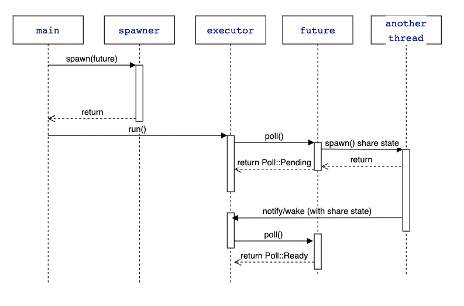

# async-book 例子, 理解 Rust 异步的执行过程
## 执行
`cargo run --example test`

## 调用链分析

1. 创建一个 channel 模拟任务队列.
2. spawn()
    将 future 包装成 task 发送到 channel, 入队.
3. executor.run()
    1. 从 channel 获得 task, 获得 task 包裹的 future, 调用 future.poll(context)
    2. context 参数是什么?
        1. 从 task 构建 Waker
            该 Waker 的 wake() 函数的实现是将当前 task 发到 channel, 加入任务队列.
        2. 将 waker 包在 context 里.
4. future.poll(context) (poll 函数一般不用手动写, 由编译器自动生成)
    - 执行业务逻辑, 判断是否 ready.
    - 从 context 里获得 waker, 将 waker 挂在 shared_state 上

**接下来, 只要在异步事件完成后触发 shared_state.waker.wake() 函数即可将 task 加入任务队列**

标准的实现一般是有一个 reactor 使用 epoll/kqueue 监听事件, 来帮我们触发 wake.
在这个简单的例子里我们使用线程模拟异步操作, 我们在 TimerFuture 的构造函数里创建线程, 该线程在指定的延时后触发 shared_state.waker.wake().

## 时序图

## from
https://rust-lang.github.io/async-book/